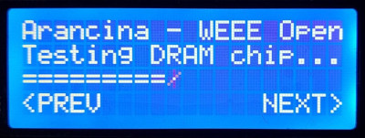
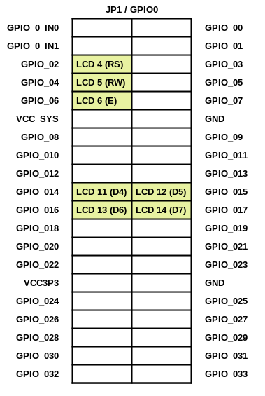

# LCD Test Project

A simple project to test the communication between an FPGA and an LCD display connected to its GPIO pins. Includes a fancy progress bar and rotating cursor, for future inclusion in other projects.

### Components:

 - Terasic [DE0-Nano](https://www.terasic.com.tw/cgi-bin/page/archive.pl?No=593) board
 - 20x4 LCD Display (2004A)
 - Contrast regulation potentiometer (10K)

### Software:

 - Quartus Prime Lite Edition 20.1.1
 - ModelSim - Intel FPGA Starter Edition 2020.1

### Screenshot:

### Data / control signals wiring:

